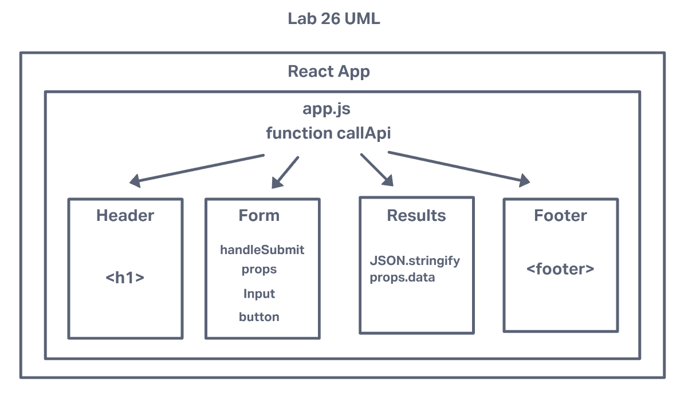

# LAB 26

## Project: Component Based UI

### Author: Simon Son

### Problem Domain

Setup the basic scaffolding of the application, with intent being to add more functionality to the system as we go. This initial build sets up the file structure so that we can progressively build this application in a scalable manner

Refactor the RESTy application as follows:

* Convert all child components of App.js from classes to functions
  * The App component serves as the container for all sub-components of this application.
  * Leave this component as a Class.
  * Make sure all base styles for App are included in a .scss imported within App.js.
  * Ensure that the Header, Footer, Results and Form components are imported using ES6 import syntax.

* Use .scss files to style each component
  * Each of the components use their own .scss file for styling.

* Core application functionality should remain unchanged:
  * The Form component should:
    * Call a function on submit that updates the App component via a function sent down as a prop so that the app can process the form values.
  * The Results component should show mock API results.

### Links and Resources

* [GitHub](https://github.com/sson68x/resty-app/pull/1)
* [Class Demo](https://github.com/codefellows/seattle-javascript-401d47/tree/main/class-26)

### Setup

* run npm start

#### `.env` requirements (where applicable)

* N/A

### UML

